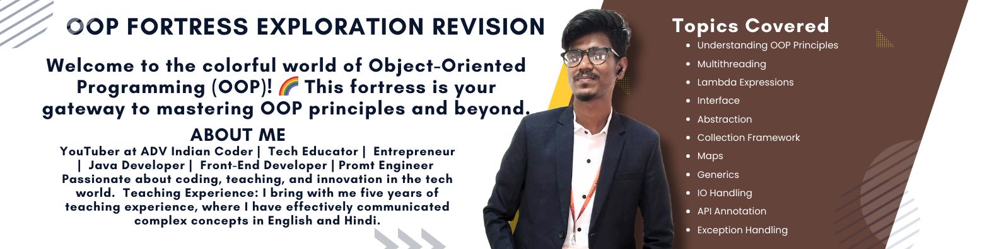

# 🏰 OOP Fortress Exploration Revision

Welcome to the colorful world of Object-Oriented Programming (OOP)! 🌈 This fortress is your gateway to mastering OOP principles and beyond.

## Topics Covered:

### 1. 🎨 **Understanding OOP Principles:**
   - In-depth exploration of OOP principles, including 🏰 encapsulation, 👑 inheritance, and 🔮 polymorphism.

### 2. 🚀 **Multithreading:**
   - Dive into the realm of multithreading concepts in Java, mastering the art of parallel execution.

### 3. 🌟 **Lambda Expressions:**
   - Harness the power of lambda expressions for concise and expressive Java code.

### 4. 🤝 **Interface:**
   - Comprehensive coverage of Java interfaces, fostering collaboration and achieving multiple inheritance.

### 5. 🌌 **Abstraction:**
   - Further exploration of abstraction concepts, creating abstract classes and interfaces.

### 6. 📚 **Collection Framework:**
   - Journey through the Java Collections Framework, discovering the magic of 📦 lists, 🧊 sets, 🗺️ maps, and iterators.

### 7. 🗺️ **Maps:**
   - In-depth coverage of Java Maps, navigating through HashMap, TreeMap, and LinkedHashMap.

### 8. 🔄 **Generics:**
   - Delve into the world of generic programming, creating classes and methods that adapt to various types.

### 9. 📥 **IO Handling:**
   - Practical examples and explanations for handling Input/Output operations in Java.

### 10. 📌 **API Annotation:**
    - Understand the importance and utility of annotations in Java's API landscape.

### 11. 🚦 **Exception Handling:**
    - Master the art of handling exceptions in Java with grace and precision.

## How to Use This Repository:

- Each topic is colorfully organized into its dedicated directory.
- Navigate to the respective directories to find detailed explanations, code examples, and practice exercises.
- Code snippets and examples are provided to paint a vivid picture of Java concepts.

## Why Explore These Java Concepts:

- 🎨 Strengthen your programming palette with a diverse range of Java concepts.
- 💪 Build confidence in crafting vibrant, expressive, and error-resistant Java code.
- 🌐 Prepare yourself for an adventurous journey through various aspects of Java development.

## Contribution:

Contributions are welcome! If you have additional examples, exercises, or improvements to the existing content, feel free to open a pull request.

Happy coding! 🚀🌈
